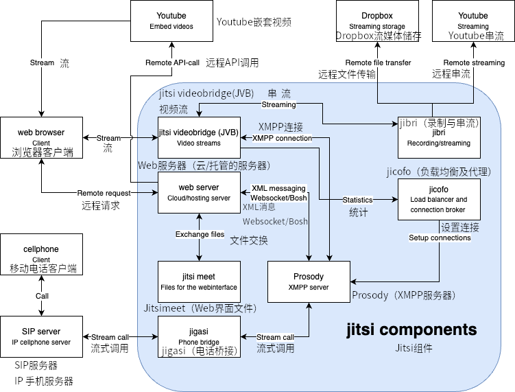

本节提供了 Jitsi 基础设施的全局概览。如果你刚开始为该项目做贡献，我们强烈建议你仔细阅读本节内容。

## 组件
Jitsi 包含以下 [项目](https://jitsi.org/projects/) ：

* [Jitsi Meet](https://jitsi.org/jitsi-meet) - 一个兼容 WebRTC 的 JavaScript 应用程序，使用 Jitsi Videobridge 提供高质量、可扩展的视频会议。基于 React 和 React Native 构建。
* [Jitsi Videobridge (JVB)](https://jitsi.org/jitsi-videobridge) - 兼容 WebRTC 的服务器，旨在充当会议参与者之间的视频流路由。
* [Jitsi Conference Focus (jicofo)](https://github.com/jitsi/jicofo) -  Jitsi Meet 会议中的服务器端焦点组件，负责管理媒体会话，并作为参与者和 videobridge 之间的负载均衡器。
* [Jitsi Gateway to SIP (jigasi)](https://github.com/jitsi/jigasi) - 服务器端应用程序，允许常规 SIP 客户端加入 Jitsi Meet 会议。
* [Jitsi Broadcasting Infrastructure (jibri)](https://github.com/jitsi/jibri) - 一组用于录制和/或直播 Jitsi Meet 会议的工具，通过启动一个在虚拟帧缓冲区中呈现的 Chrome 实例，并使用 ffmpeg 捕获和编码输出。

Jitsi 使用的外部软件：
* [Prosody](https://prosody.im/) - 用于信令的 XMPP 服务器。

## 架构示意图
下图描述了之前提到的各个组件之间的具体连接关系，以及它们与外部系统的集成方式。

外部通讯可以分为两个主要组别。首先，客户端之间请求视频或音频连接的通讯是通过远程请求和数据流进行的。第二类外部通讯是与外部服务的连接，这些服务帮助存储录音、直播录音、流媒体视频或协助创建会议。

## 代码结构

在本节中，我们将查看代码库的主要部分，并了解它们的用途。

**./react/features**

此文件夹是编写代码的最佳起点，因为它包含 Android、iOS 和网页版本应用中使用的大部分组件。该源文件夹根据 Jitsi 提供的不同功能进行划分，例如身份验证、聊天交互、键盘快捷键、截图、远程控制和虚拟背景。每个功能都有一个对应的文件夹，并进一步细分，以保持代码的层次结构和一致性。

如前所述，代码库主要由 React 和 React Native 组成，后者是移动应用的 React 版本。大多数功能使用 React 的所谓类组件[^class-comp]，不过一些新功能开始使用 hooks[^func-comp] 这一新的方式来编写功能组件。

该应用还使用 React Redux，作为一个通用状态存储，用于跟踪整个应用程序中使用的重要参数。有关 React Redux 的更多信息，请参见 [^react-redux]。

大多数功能还包含一个名为 `middleware.js` 的文件。该文件充当组件与应用程序其他功能之间的桥梁。

**./modules/external-api**

在此文件夹中，可以找到外部 API。该 API 可用于多种事件，如参与者加入/离开会议、头像或聊天的变化，以及使用麦克风或摄像头时的错误处理。

**./android and ./ios**

这两个文件夹分别包含 Android 和 iOS 应用的基础内容。然而，应用程序本身及其组件的代码位于 **react/features** 文件夹中，该文件夹的详细说明已在本节前面介绍。

**./conference.js**

此文件位于项目根目录中，包含用户与会议室之间所有交互的基础内容。它包括建立连接、加入会议室、静音与取消静音等功能，还负责收集会议室中参与者的信息。

**./lang**

该文件夹包含 Jitsi Meet 中的所有不同语言翻译。翻译内容可以在代码中通过翻译映射中的键找到，这些键位于 `main-[language].json` 文件中。

**./css**

该文件夹包含项目中使用的所有 CSS 文件。文件（主要是 .scss 文件[^scss]）按照它们所应用的功能进行划分，与 React 功能类似。

## 测试

主要的代码更改测试通过自动化压力测试完成，除此之外还进行手动测试。

压力测试位于一个单独的代码库 [Jitsi Meet Torture](https://github.com/jitsi/jitsi-meet-torture) 中。该项目包含多个关键功能的端到端测试，如点对点连接和邀请功能。测试可在 iOS、Android 和网页端进行，涵盖 Jitsi Meet 支持的所有平台。对于项目成员的拉取请求，测试将通过 Jenkins 实例与持续集成相结合自动运行，测试基于 [meet.jit.si](https://meet.jit.si) 实例。其他成员也可以在本地运行这些测试，测试结果会显示在自动生成的网页上。

手动测试在代码审查时进行，此外，还有可以免费下载和部署的测试版本，或在 [beta 测试服务器](https://beta.meet.jit.si/) 上进行测试。
