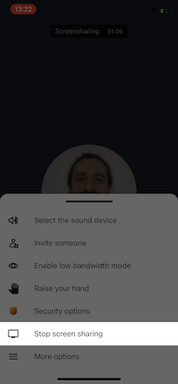
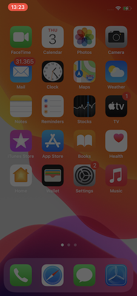
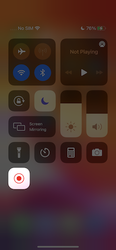

Jitsi Meet iOS SDK 提供与 Jitsi Meet 应用相同的用户体验，并以可定制的方式嵌入到您的应用中。

:::important
需要 iOS 15.1 或更高版本。
:::

## 使用 SDK 的示例应用程序

如果您想了解将 Jitsi Meet SDK 集成到原生应用程序中的简单性，可以查看 [示例应用程序库](https://github.com/jitsi/jitsi-meet-sdk-samples#ios)。

## 用法

将 SDK 集成到项目中有两种方法：

- 使用 CocoaPods
- 自行构建

### 使用 CocoaPods

推荐使用 CocoaPods 来使用 SDK。为此，请将 `JitsiMeetSDK` 依赖项添加到现有的 `Podfile` 中，或按照以下示例创建一个新的：

```ruby
platform :ios, '15.1'

workspace 'JitsiMeetSDKTest.xcworkspace'

target 'JitsiMeetSDKTest' do
  project 'JitsiMeetSDKTest.xcodeproj'

  pod 'JitsiMeetSDK'
end
```

将 `JitsiMeetSDKTest` 替换为您的项目和目标名称。

由于 SDK 请求摄像头和麦克风访问权限，请确保在 `Info.plist` 文件中包含所需的 `NSCameraUsageDescription` 和 `NSMicrophoneUsageDescription` 条目。

为了确保应用在后台正常工作，请选择“音频”和“VoIP”后台模式。

最后，由于 SDK 会根据会议状态显示和隐藏状态栏，您可能需要在 `Info.plist` 文件中将 `UIViewControllerBasedStatusBarAppearance` 设置为 `NO`。

### 自行构建

1. 安装所有所需的 [依赖项](https://jitsi.github.io/handbook/docs/dev-guide/dev-guide-mobile-jitsi-meet)。

2. 构建它：

```bash
mkdir -p ios/sdk/out
xcodebuild clean \
    -workspace ios/jitsi-meet.xcworkspace \
    -scheme JitsiMeetSDK
xcodebuild archive \
    -workspace ios/jitsi-meet.xcworkspace \
    -scheme JitsiMeetSDK  \
    -configuration Release \
    -sdk iphonesimulator \
    -destination='generic/platform=iOS Simulator' \
    -archivePath ios/sdk/out/ios-simulator \
    SKIP_INSTALL=NO \
    BUILD_LIBRARY_FOR_DISTRIBUTION=YES
xcodebuild archive \
    -workspace ios/jitsi-meet.xcworkspace \
    -scheme JitsiMeetSDK  \
    -configuration Release \
    -sdk iphoneos \
    -destination='generic/platform=iOS' \
    -archivePath ios/sdk/out/ios-device \
    SKIP_INSTALL=NO \
    BUILD_LIBRARY_FOR_DISTRIBUTION=YES
xcodebuild -create-xcframework \
    -framework ios/sdk/out/ios-device.xcarchive/Products/Library/Frameworks/JitsiMeetSDK.framework \
    -framework ios/sdk/out/ios-simulator.xcarchive/Products/Library/Frameworks/JitsiMeetSDK.framework \
    -output ios/sdk/out/JitsiMeetSDK.xcframework
```

成功构建 Jitsi Meet SDK for iOS 后，生成的 XCFramework 将位于 `ios/sdk/out` 目录中。

注意：您的应用将需要依赖于 JitsiWebRTC CocoaPod。

## API

JitsiMeet 是一个 iOS 框架，它体现了完整的 Jitsi Meet 体验，并使第三方应用可以重用。

要开始：

1. 使用故事板或界面构建器向您的应用添加 `JitsiMeetView`，例如。

2. 然后，在视图加载后，在您的控制器中设置代理并加载所需的 URL：

```objc
- (void)viewDidLoad {
  [super viewDidLoad];

  JitsiMeetView *jitsiMeetView = (JitsiMeetView *) self.view;
  jitsiMeetView.delegate = self;

  JitsiMeetConferenceOptions *options = [JitsiMeetConferenceOptions fromBuilder:^(JitsiMeetConferenceOptionsBuilder *builder) {
      builder.serverURL = [NSURL URLWithString:@"https://meet.jit.si"];
      builder.room = @"test123";
      builder.audioOnly = YES;
  }];

  [jitsiMeetView join:options];
}
```

### JitsiMeetView 类

`JitsiMeetView` 类是 SDK 的入口点。它是 `UIView` 的子类，在指定区域中渲染完整的会议。

#### delegate

获取/设置 `JitsiMeetViewDelegate` 的属性。

#### join:JitsiMeetConferenceOptions

根据给定选项加入会议。

```objc
  JitsiMeetConferenceOptions *options = [JitsiMeetConferenceOptions fromBuilder:^(JitsiMeetConferenceOptionsBuilder *builder) {
      builder.serverURL = [NSURL URLWithString:@"https://meet.jit.si"];
      builder.room = @"test123";
      builder.audioOnly = NO;
      builder.audioMuted = NO;
      builder.videoMuted = NO;
      builder.welcomePageEnabled = NO;
      [builder setConfigOverride:@"requireDisplayName" withBoolean:YES];
      [builder setConfigOverride:@"customToolbarButtons" withArray:@[
      @{
          @"icon": @"https://w7.pngwing.com/pngs/987/537/png-transparent-download-downloading-save-basic-user-interface-icon-thumbnail.png",
          @"id": @"btn1",
          @"text": @"Button one"
        }, 
      @{
          @"icon": @"https://w7.pngwing.com/pngs/987/537/png-transparent-download-downloading-save-basic-user-interface-icon-thumbnail.png",
          @"id": @"btn2",
          @"text": @"Button two"
      }]];
  }];

  [jitsiMeetView join:options];
```

#### leave

离开当前活动的会议。

#### hangUp

本地参与者离开当前会议。

#### setAudioMuted

根据 `muted` 参数设置本地参与者的音频静音状态。

#### setVideoMuted

根据 `muted` 参数设置本地参与者的视频静音状态。

#### sendEndpointTextMessage

通过数据通道向特定参与者或所有参与者发送消息。如果 `to` 参数为空，则消息将发送给会议中的所有参与者。

要获取 `participantId`，应监听 `PARTICIPANT_JOINED` 事件，其中 `data` 包含 id，并且应该以某种方式存储。

#### toggleScreenShare

根据 `enabled` 参数设置本地参与者的屏幕共享状态。

#### openChat

打开聊天对话框。如果 `to` 包含有效的 `participantId`，则将打开与该特定参与者的私人聊天。

#### sendChatMessage

通过发送聊天消息给特定参与者或所有参与者。如果 `to` 参数为空，则消息将发送给会议中的所有参与者。

要获取 `participantId`，应监听 `PARTICIPANT_JOINED` 事件，其中 `data` 包含 id，并且应该以某种方式存储。

#### closeChat

关闭聊天对话框。

#### retrieveParticipantsInfo

以作为参数传递的 completionHandler 检索参与者信息。

#### Universal / deep linking

为了支持 Universal / deep linking，`JitsiMeet` 提供了两个类方法，您的应用代理应调用这些方法，以便应用可以处理这些链接。

如果这些函数返回 NO，则意味着 URL 未被 SDK 处理。这在宿主应用程序使用其他也使用链接的 SDK 时很有用。

```objc
-  (BOOL)application:(UIApplication *)application
continueUserActivity:(NSUserActivity *)userActivity
  restorationHandler:(void (^)(NSArray *restorableObjects))restorationHandler
{
  return [[JitsiMeet sharedInstance] application:application
               continueUserActivity:userActivity
                 restorationHandler:restorationHandler];
}
```

以及以下之一：

```objc
// 请参阅 https://developer.apple.com/documentation/uikit/uiapplicationdelegate/1623073-application?language=objc
- (BOOL)application:(UIApplication *)app
            openURL:(NSURL *)url
            options:(NSDictionary<UIApplicationOpenURLOptionsKey,id> *)options {
  return [[JitsiMeet sharedInstance] application:app
                            openURL:url
                            options: options];
}
```

### JitsiMeetViewDelegate

此委托是可选的，可以通过 `delegate` 属性在 `JitsiMeetView` 实例上设置。

它提供有关会议状态的信息：是否已加入、是否已离开、是否发生故障？

所有委托中的方法都是可选的。

#### conferenceJoined

在加入会议时调用。`data` 包含以下信息：

- `url`：会议 URL

#### conferenceTerminated

当活动会议结束时调用，无论是由于用户选择还是由于故障。`data` 包含以下信息：

- `url`：会议 URL
- `error`：如果会议正常结束，则缺失；否则包含错误消息

#### conferenceWillJoin

在加入会议之前调用。`data` 包含以下信息：

- `url`：会议 URL

#### enterPictureInPicture

当用户请求进入画中画模式时调用。应用程序现在应该激活其画中画实现（并调整关联的 `JitsiMeetView` 大小。后者会自动检测其新大小并调整其用户界面以适应通常与画中画相关的小尺寸）。

`data` 字典为空。

#### participantJoined

当参与者加入会议时调用。`data` 包含以下信息：

- `email`：参与者的电子邮件。如果远程参与者未设置，则可能未设置。
- `name`：参与者的姓名。
- `role`：参与者的角色。
- `participantId`：参与者的 ID。

#### participantLeft

当参与者离开会议时调用。`data` 包含以下信息：

- `participantId`：离开的参与者的 ID。

#### audioMutedChanged

当本地参与者的音频静音或取消静音时调用。`data` 包含以下信息：

- `muted`：布尔值，指示音频是否静音。

#### videoMutedChanged

当本地参与者的视频静音或取消静音时调用。`data` 包含以下信息：

- `muted`：整数，指示视频是否静音。0 表示未静音，4 表示静音。

#### endpointTextMessageReceived

当接收到端点文本消息时调用。

`data` 字典包含一个 `senderId` 键，表示发送者的参与者 ID，以及一个 `message` 键，表示内容。

#### screenShareToggled

当参与者开始或停止共享屏幕时调用。

`data` 字典包含一个 `participantId` 键，表示参与者的 ID，以及一个 `sharing` 键，表示布尔值。

#### chatMessageReceived

当接收到聊天文本消息时调用。`data` 包含以下信息：

- `senderId`：发送消息的参与者的 ID。
- `message`：消息的内容。
- `isPrivate`：如果消息是私密的，则为 true；否则为 false。
- `timestamp`：消息的（可选）时间戳。

#### chatToggled

当聊天对话框打开或关闭时调用。`data` 包含以下信息：

- `isOpen`：如果聊天对话框打开，则为 true；否则为 false。

#### readyToClose

当 SDK 准备关闭时调用。此时没有会议正在进行。

#### customOverflowMenuButtonPressed

当自定义按钮添加到溢出菜单时调用。`data` 包含以下信息：

- `id`：被按下的自定义按钮的 ID。
- `text`：被按下的自定义按钮的标签。

### 画中画

`JitsiMeetView` 在以画中画样式场景呈现时会自动调整其用户界面，大小矩形不足以容纳其“完整”用户界面。

Jitsi Meet SDK 目前在 iOS 上未实现本地画中画。如果需要，应用程序需要自行实现非本地画中画，并调整 `JitsiMeetView` 的大小。

如果 `delegate` 实现了 `enterPictureInPicture:`，则通话工具栏将渲染一个按钮，以便用户请求进入画中画。

## Dropbox 集成

要设置 Dropbox 集成，请按照以下步骤操作：

1. 将以下内容添加到应用的 Info.plist 中，并将 `<APP_KEY>` 替换为您的 Dropbox 应用密钥：

```
<key>CFBundleURLTypes</key>
<array>
  <dict>
    <key>CFBundleURLName</key>
    <string></string>
    <key>CFBundleURLSchemes</key>
    <array>
      <string>db-<APP_KEY></string>
    </array>
  </dict>
</array>
<key>LSApplicationQueriesSchemes</key>
<array>
  <string>dbapi-2</string>
  <string>dbapi-8-emm</string>
</array>
```

2. 确保您的应用调用 Jitsi Meet SDK 的通用/深度链接委托方法。

## 屏幕共享集成

自 JitsiMeetSDK 版本 3.3.0 起，iOS 增加了屏幕共享功能。此功能适用于运行 iOS 14 或更高版本的应用程序。

为此，我们使用 `Broadcast Upload Extension` 捕获用户屏幕的内容。通过 Unix 面向流的套接字通信将帧传递给 RN WebRTC，扩展作为客户端，React Native WebRTC 作为服务器。

以下文档涵盖了 [示例应用程序](https://github.com/jitsi/jitsi-meet-sdk-samples/tree/master/ios/swift-screensharing/JitsiSDKScreenSharingTest) 中提供的代码。

### 创建广播上传扩展

`广播上传扩展` 是 iOS 中定义的一种应用扩展类型，用于捕获用户屏幕的内容。

要创建该扩展，您需要为应用添加一个新目标，选择 `广播上传扩展` 模板。填写所需的名称，将语言更改为 Swift，确保未选中 `包含 UI 扩展`，因为在本案例中我们不需要自定义 UI，然后按完成（截图 1）。您会看到项目树中添加了一个新文件夹，包含 `SampleHandler.swift` 类。同时，确保将新创建的扩展的 `Deployment Info` 更新为 iOS 14 或更高版本。要了解更多关于创建应用扩展的信息，请查看 [官方文档](https://developer.apple.com/library/archive/documentation/General/Conceptual/ExtensibilityPG/ExtensionCreation.html)。


扩展创建完成后，下一步是设置套接字连接，添加处理接收帧的功能，并将其发送到 RN WebRTC 进行处理。我们将使用示例项目中提供的代码。将 `SampleUploader.swift`、`SocketConnection.swift`、`DarwinNotificationCenter.swift` 和 `Atomic.swift` 文件复制到扩展的文件夹中，并确保它们被添加到目标中。

### 设置套接字连接

通过 Unix SOCK_STREAM 套接字将录制的帧发送到 RN WebRTC。扩展需要设置为客户端端点。

我们将更新 `SampleHandler.swift`，以使用 `SocketConnection` 类初始化与 RN WebRTC 的套接字连接。但在此之前，我们需要设置套接字将用于通信的文件。

尽管应用扩展捆绑包嵌套在其包含应用的捆绑包中，但正在运行的应用扩展和包含应用之间没有直接访问彼此容器的权限。我们将通过启用数据共享来解决这个问题。使用 Xcode 或开发者门户为包含应用及其包含的应用扩展启用应用组。接下来，在门户中注册应用组，并在包含应用中指定要使用的应用组。要了解如何使用应用组，请参见 [添加应用到应用组](https://developer.apple.com/library/archive/documentation/Miscellaneous/Reference/EntitlementKeyReference/Chapters/EnablingAppSandbox.html#//apple_ref/doc/uid/TP40011195-CH4-SW19)。

现在，在 `SampleHandler` 类中添加 `private var socketFilePath: String`，并使用新注册的应用组设置共享文件名 `rtc_SSFD`，如下所示：

```swift
private enum Constants {
    static let appGroupIdentifier = "my.custom.app.group"
}

private var socketFilePath: String {
    let sharedContainer = FileManager.default.containerURL(forSecurityApplicationGroupIdentifier: Constants.appGroupIdentifier)
     
    return sharedContainer?.appendingPathComponent("rtc_SSFD").path ?? ""
}
```

接下来，我们将配置 `SocketConnection` 使用共享文件。在 `SampleHandler` 类中添加 `private var clientConnection: SocketConnection?`，并重写 `init` 进行设置，如下所示：

```swift
override init() {
    super.init()
    if let connection = SocketConnection(filePath: socketFilePath) {
        clientConnection = connection
    }
} 
```

为了使其工作，RN WebRTC 端需要知道我们为应用配置的应用组标识符。我们通过在应用的 `Info.plist` 中添加一个名为 `RTCAppGroupIdentifier` 的新键，并将应用组标识符作为值来实现。

### 打开套接字连接

要开始屏幕共享，JitsiMeet SDK 提供 UI 来向用户展示 `RPSystemBroadcastPickerView`。默认情况下，选择器将显示所有可用的广播提供者。为了将选择器限制为我们的特定广播提供者，我们需要将 `preferredExtension` 设置为广播扩展的包标识符。我们通过在应用的 Info.plist 中添加一个名为 `RTCScreenSharingExtension` 的新键并将广播扩展的包标识符设置为值来实现。

一旦开始屏幕录制，ReplayKit 将调用 `SampleHandler` 类中的方法来处理视频缓冲区，以及启动和停止广播的方法。`broadcastStarted(withSetupInfo:)` 方法是我们打开与 RN WebRTC 服务器的套接字连接的入口点。为此，我们需要发布服务器正在监听的 `broadcastStarted` 通知，以便开始连接，我们准备连接。向 `SampleHandler` 类添加一个新的方法 `openConnection()`，该方法将重复尝试连接服务器，以防服务器连接启动延迟：

```swift
func openConnection() {
    let queue = DispatchQueue(label: "broadcast.connectTimer")
    let timer = DispatchSource.makeTimerSource(queue: queue)
    timer.schedule(deadline: .now(), repeating: .milliseconds(100), leeway: .milliseconds(500))
    timer.setEventHandler { [weak self] in
        guard self?.clientConnection?.open() == true else {
            return
        }
        
        timer.cancel()
    }
    
    timer.resume()
}
```

接下来，更新 `broadcastStarted(withSetupInfo:)` 方法以发布通知并连接：

```swift
override func broadcastStarted(withSetupInfo setupInfo: [String: NSObject]?) {
    DarwinNotificationCenter.shared.postNotification(.broadcastStarted)
    openConnection()
}
```

`DarwinNotificationCenter` 是一个简单的助手类，用于广播系统范围的通知，而不仅仅是在单个程序内发送，正如 `NSNotificationCenter` 所做的那样。这种机制允许应用注册接收来自扩展的通知。

现在我们准备开始发送视频帧。

### 发送视频帧

RN WebRTC 设计用于处理编码为 jpeg 的图像，封装在 `CFHTTPMessage` 对象中。以下头字段是必需的：

- `Content-Length` - jpeg 数据的大小
- `Buffer-Width` - 缓冲区的宽度，以像素为单位
- `Buffer-Height` - 缓冲区的高度，以像素为单位
- `Buffer-Orientation` - 描述视频方向的 `RPVideoSampleOrientationKey` 的值。

我们将使用 `SampleUploader` 类准备并发送视频帧。在 `SampleHandler` 类中添加一个新的 `private var uploader: SampleUploader?`，并更新 `init()` 以初始化它：

```swift
override init() {
    super.init()
    if let connection = SocketConnection(filePath: socketFilePath) {
      clientConnection = connection
      uploader = SampleUploader(connection: connection)
    }
}
```

接下来，我们将更新 `processSampleBuffer(_ sampleBuffer: CMSampleBuffer, with sampleBufferType: RPSampleBufferType)` 方法以发送视频帧。出于性能考虑，我们还将实现一个非常简单的机制，通过使用每第三帧来调整帧速率。在类中添加一个新的 `private var frameCount = 0`，并按如下方式更新上述方法：

```swift
override func processSampleBuffer(_ sampleBuffer: CMSampleBuffer, with sampleBufferType: RPSampleBufferType) {
    switch sampleBufferType {
    case .video:
        // 通过使用每第三帧来实现帧速率调整的非常简单机制
        frameCount += 1
        if frameCount % 3 == 0 {
            uploader?.send(sample: sampleBuffer)
        }
    default:
        break
    }
}
```

此外，更新 `broadcastStarted(withSetupInfo setupInfo: [String: NSObject]?)`，在每次开始屏幕共享时重置 `frameCount`：

```swift
override func broadcastStarted(withSetupInfo setupInfo: [String: NSObject]?) {
    frameCount = 0
    
    DarwinNotificationCenter.shared.postNotification(.broadcastStarted)
    openConnection()
}
```

至此，我们已经完成了发送视频帧的工作，可以进入最后一步，处理停止屏幕共享。

### 处理停止屏幕共享

除了会议中的用户界面（截图 2）外，ReplayKit 与 iOS 的集成还支持从状态栏（截图 3）或使用控制中心（截图 4）停止屏幕录制。

   

任何这些操作都将触发我们 `SampleHandler` 实现中的 `broadcastFinished`。这是我们关闭连接和清理的入口点。我们将更新 `broadcastFinished`，以发布 `DarwinNotification.broadcastStopped` 的系统范围通知并关闭连接：

```swift
override func broadcastFinished() {
    DarwinNotificationCenter.shared.postNotification(.broadcastStopped)
    clientConnection?.close()
}
```

我们还需要处理另一种情况，即服务器连接中断，例如在屏幕共享时离开会议或遇到错误。我们将通过处理 `clientConnection.didClose` 事件来解决这个问题。在 `SampleHandler` 类中添加一个新方法 `setupConnection`，并更新 `init` 以调用它：

```swift
func setupConnection() {
    clientConnection?.didClose = { [weak self] error in      
        if let error = error {
            self?.finishBroadcastWithError(error)
        } else {
            // 使用 NSError 而不是 Error 会使显示的失败消息更友好
            let JMScreenSharingStopped = 10001
            let customError = NSError(domain: RPRecordingErrorDomain, code: JMScreenSharingStopped, userInfo: [NSLocalizedDescriptionKey: "屏幕共享已停止"])
            self?.finishBroadcastWithError(customError)
        }
    }
}

override init() {
    super.init()
    if let connection = SocketConnection(filePath: socketFilePath) {
      clientConnection = connection
      setupConnection()
      
      uploader = SampleUploader(connection: connection)
    }
}
```

现在，我们已经完成了实现，只需在 Jitsi 中启用此功能。我们通过使用 `JitsiMeetConferenceOptionsBuilder` 配置 `ios.screensharing.enabled` 功能标志来实现，代码如下：

```swift
let options = JitsiMeetConferenceOptions.fromBuilder { [weak self] builder in
    ...
    builder.setFeatureFlag("ios.screensharing.enabled", withBoolean: true)
}
meetView.join(options)
```

最后，我们准备测试该实现。在此之前，请确保将 voip 添加到应用的 `Info.plist` 中的 `UIBackgroundModes`，以便在应用在后台时仍能正常工作。

### TL;DR

- 向应用添加一个没有 UI 的 `广播上传扩展`。将部署信息更新为在 iOS 14 或更高版本中运行。
- 从示例项目中复制 `SampleUploader.swift`、`SocketConnection.swift`、`DarwinNotificationCenter.swift` 和 `Atomic.swift` 文件到扩展中。确保它们已添加到扩展的目标中。
- 将应用和扩展添加到同一应用组。接下来，将应用组 ID 值添加到应用的 `Info.plist` 中的 `RTCAppGroupIdentifier` 键。
- 在应用的 `Info.plist` 中添加一个新键 `RTCScreenSharingExtension`，其值为扩展的 `Bundle Identifier`。
- 使用示例项目中的代码更新 `SampleHandler.swift`。将 `appGroupIdentifier` 常量更新为您的应用和扩展均注册的应用组名称。
- 更新 `JitsiMeetConferenceOptions`，使用 `ios.screensharing.enabled` 功能标志启用屏幕共享。
- 确保将 voip 添加到应用的 `Info.plist` 中的 `UIBackgroundModes`，以便在应用在后台时仍能正常工作。

## 调试

- 如果您选择使用 `Console` 应用进行调试，请确保选择：
  `Action`（选项卡） -> `Include Info Messages`
  `Action`（选项卡） -> `Include Debug Messages`

- 在搜索过滤器中，请输入 `JitsiMeetSDK`，按回车键并将 `ANY` 替换为 `Category`。
  这将显示与我们的 SDK 相关的所有实时日志。
