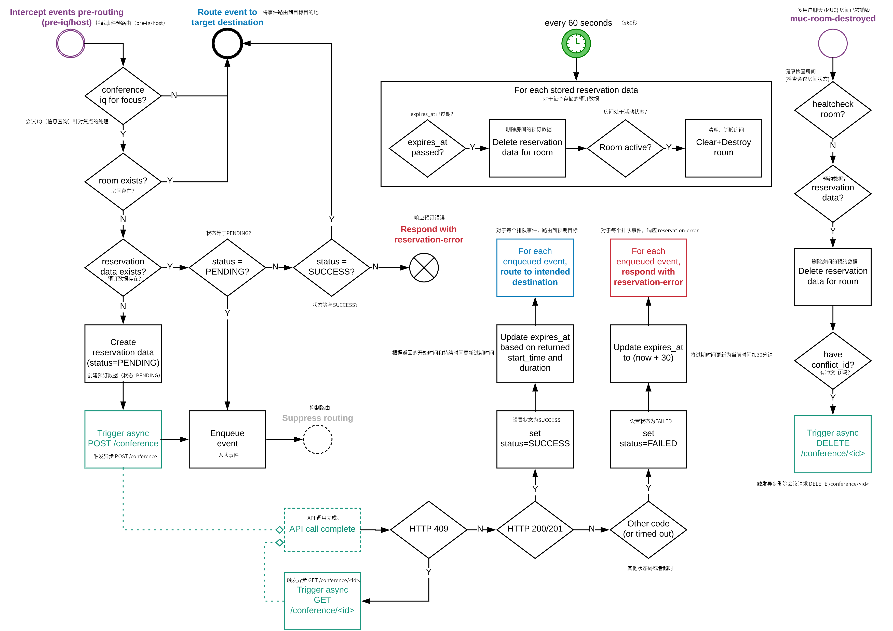

### Support for a reservation system over REST API

It is possible to connect to an external conference reservation system using a
REST API. Before a new Jitsi Meet conference is created, the reservation system will be
queried for room availability. The system is supposed to return a positive or
negative response code, which also contains conference duration. Prosody will enforce
conference duration and if the time limit is exceeded the conference will be
terminated.

#### Enable reservation system

In order to enable the reservation system, the URL base for the REST API endpoint must be
 configured. Under the main virtual host in prosody, enable module "reservations" and 
add the config `reservations_api_prefix`:

```
VirtualHost "jitmeet.example.com"
    -- ....
    modules_enabled = {
        -- ....
        "reservations";
    }
    reservations_api_prefix = "http://reservation.example.com"
```

The URL base is used to construct the request URL. Currently, only `'/conference'`
endpoint is supported, so all request will go to:

```
http://reservation.example.com/conference
```
Additional configuration options are available:
* "reservations_api_timeout" to change API call timeouts (defaults to 20 seconds)
* "reservations_api_headers" to specify custom HTTP headers included in
  all API calls e.g. to provide auth tokens.
* "reservations_api_retry_count" to specify the number of times API call failures are retried (defaults to 3)
* "reservations_api_retry_delay" seconds to wait between retries (defaults to 3s)
* "reservations_api_should_retry_for_code" as a function that takes an HTTP response code and
  returns true if the API call should be retried. By default, retries are done for 5XX
  responses. Timeouts are never retried, and HTTP call failures are always retried.
* "reservations_enable_max_occupants" to enable support for setting max occupants. If this is set to `true`, and if
  the API response payload includes a "max_occupants" value, then that value will be set as the max occupancy limit
  for that specific room.
  * "muc_max_occupants" module must also be enabled for this to work.
* "reservations_enable_lobby_support" to enable support for lobby. If this is set to `true`, and if
  the API response payload includes a "lobby" field set to `true` , then the lobby will be enabled for the room.
  * "muc_lobby_rooms" and "persistent_lobby" modules must also be enabled for this to work.
* "reservations_enable_password_support" to enable support for room password. If this is set to `true`, and if
  the API response payload includes a "password" value, then that value will be set as room password. Users will then
  be required to know that password to be able to join the room, or in the case where lobby is enabled, can use the
  password to bypass the lobby.

```
    --- The following are all optional
    reservations_api_headers = {
        ["Authorization"] = "Bearer TOKEN-237958623045";
    }
    reservations_api_timeout = 10  -- timeout if API does not respond within 10s
    reservations_api_retry_count = 5  -- retry up to 5 times
    reservations_api_retry_delay = 1  -- wait 1s between retries
    reservations_api_should_retry_for_code = function (code)
        return code >= 500 or code == 408
    end
    reservations_enable_max_occupants = true -- enable integration with muc_max_occupants
    reservations_enable_lobby_support = true -- enable integration with muc_lobby_rooms
    reservations_enable_password_support = true -- enable support for setting room passwords
```

#### Call flow

##### Notes

All API calls use the following datetime format:

`yyyy-MM-dd'T'HH:mm:ss.SSSX` - more info can be found in
`SimpleDateFormat` [JavaDoc]

[JavaDoc]: https://docs.oracle.com/javase/6/docs/api/java/text/SimpleDateFormat.html

##### Conference allocation

When the first user joins a MUC room (i.e. Jitsi Meet URL is opened), an `HTTP POST`
request is sent to `'/conference'` endpoint with the following parameters
included:

* `name (string)` - short name of the conference room (not full MUC address). If tenant is used, the name will be `[tenant]roomname`.
* `start_time (string)` - conference start date and time
* `mail_owner (string)` - if authentication system is enabled this field will
 contain user's identity. It that case it will not be possible to create a new
  conference room without authenticating.

The payload sent to the endpoint will be encoded as `application/x-www-form-urlencoded`.

The reservation system is expected to respond with one of the following
responses:

###### HTTP 200 or 201 Conference created successfully

In the HTTP response, a JSON object is expected. It should contain conference `id`
assigned by the system and `duration` measured in seconds. Sample response body:

```
{
  "id": 364758328,
  "name": "conference1234",
  "mail_owner": "user@server.com",
  "start_time": "2048-04-20T17:55:12.000Z",
  "duration": 900000
}
```

The object can optionally include a `max_occupants` key with an integer value. When provided, and if
`reservations_enable_max_occupants` is enabled, then the value will be passed to muc_mod_max_occupants to enforce
per-room occupancy limits.

### 通过REST API支持会议预订系统

可以通过REST API连接到外部会议预订系统。在创建新的Jitsi Meet会议之前，系统将查询预订系统以获取房间可用性。系统应返回一个正或负的响应代码，同时包含会议持续时间。Prosody将强制执行会议持续时间，如果超出时间限制，会议将被终止。

#### 启用预订系统

为了启用预订系统，必须配置REST API端点的基本URL。在Prosody的主虚拟主机下，启用“reservations”模块并添加配置 `reservations_api_prefix`：

```
VirtualHost "jitmeet.example.com"
    -- ....
    modules_enabled = {
        -- ....
        "reservations";
    }
    reservations_api_prefix = "http://reservation.example.com"
```

该URL基本用于构建请求URL。目前，仅支持`'/conference'`端点，因此所有请求将发送到：

```
http://reservation.example.com/conference
```

可用的其他配置选项包括：

* "reservations_api_timeout"：更改API调用超时（默认为20秒）
* "reservations_api_headers"：指定所有API调用中包含的自定义HTTP头，例如提供身份验证令牌。
* "reservations_api_retry_count"：指定API调用失败时的重试次数（默认为3）
* "reservations_api_retry_delay"：重试之间等待的秒数（默认为3秒）
* "reservations_api_should_retry_for_code"：一个函数，接受HTTP响应代码并返回true，如果API调用应重试。默认情况下，对5XX响应进行重试。超时不会重试，HTTP调用失败将始终重试。
* "reservations_enable_max_occupants"：启用设置最大占用人数的支持。如果设置为`true`，并且API响应有效负载中包含“max_occupants”值，则该值将被设置为该特定房间的最大占用限制。
  * 必须启用“muc_max_occupants”模块以使其工作。
* "reservations_enable_lobby_support"：启用大厅的支持。如果设置为`true`，并且API响应有效负载中包含一个“lobby”字段，设置为`true`，则将为房间启用大厅。
  * 必须启用“muc_lobby_rooms”和“persistent_lobby”模块以使其工作。
* "reservations_enable_password_support"：启用房间密码的支持。如果设置为`true`，并且API响应有效负载中包含一个“password”值，则该值将被设置为房间密码。用户将需要知道该密码才能加入房间，或者在启用大厅的情况下，可以使用该密码绕过大厅。

```
    --- The following are all optional 以下都是可选项
    reservations_api_headers = {
        ["Authorization"] = "Bearer TOKEN-237958623045";
    }
    reservations_api_timeout = 10  -- timeout if API does not respond within 10s 如果API在10秒内没有响应则超时
    reservations_api_retry_count = 5  -- retry up to 5 times 最多重试5次
    reservations_api_retry_delay = 1  -- wait 1s between retries 重试之间等待1秒
    reservations_api_should_retry_for_code = function (code)
        return code >= 500 or code == 408
    end
    reservations_enable_max_occupants = true -- enable integration with muc_max_occupants 启用与muc_max_occupants的集成
    reservations_enable_lobby_support = true -- enable integration with muc_lobby_rooms 启用与muc_lobby_rooms的集成
    reservations_enable_password_support = true -- enable support for setting room passwords 启用设置房间密码的支持
```

#### 调用流程

##### 注意

所有API调用使用以下日期时间格式：

`yyyy-MM-dd'T'HH:mm:ss.SSSX` - 更多信息可以在`SimpleDateFormat` [JavaDoc]中找到。

[JavaDoc]: https://docs.oracle.com/javase/6/docs/api/java/text/SimpleDateFormat.html

##### 会议分配

当第一个用户加入MUC房间（即打开Jitsi Meet URL）时，将向`'/conference'`端点发送一个`HTTP POST`请求，并包含以下参数：

* `name (string)` - 会议室的简短名称（不是完整的MUC地址）。如果使用租户，名称将为`[tenant]roomname`。
* `start_time (string)` - 会议开始的日期和时间
* `mail_owner (string)` - 如果启用了身份验证系统，该字段将包含用户的身份。在这种情况下，将无法在未进行身份验证的情况下创建新的会议室。

发送到端点的有效负载将以`application/x-www-form-urlencoded`编码。

预订系统应以以下响应之一进行响应：

###### HTTP 200 或 201 会议创建成功

在HTTP响应中，期望一个JSON对象。它应包含系统分配的会议`id`和以秒为单位的`duration`。示例响应主体：

```
{
  "id": 364758328,
  "name": "conference1234",
  "mail_owner": "user@server.com",
  "start_time": "2048-04-20T17:55:12.000Z",
  "duration": 900000
}
```

该对象可以选择性地包含一个`max_occupants`键，其值为整数。当提供时，如果启用了`reservations_enable_max_occupants`，则该值将传递给muc_mod_max_occupants以强制执行每个房间的占用限制。

###### HTTP 409 - 会议已存在

这是为了从之前的失败中恢复。如果由于某种原因会议被重启，而用户尝试再次创建房间，则该响应通知Prosody会议室已经存在。预计JSON响应主体中会包含 `conflict_id`：

```
{
  "conflict_id": 364758328
}
```

Prosody将使用 `HTTP GET` 请求获取有关给定 `conflict_id` 的冲突会议的信息。有关此请求的更多信息，请参见“读取会议信息”部分。

###### HTTP 4xx

其他响应代码将导致会议创建失败。JSON响应可以包含一个 `message` 对象，该对象将返回给客户端。

例如，`user1` 尝试通过向Jicofo发送 `conference` IQ 来启动新的会议。系统将拒绝该请求。

客户端 -> Jicofo：

```
<iq from='client1@xmpp.com' to='jicofo.meet.com' type='set'>
  <conference xmlns='http://jitsi.org/protocol/focus' room='testroom1' />
</iq>
```

Prosody -> 会议预订系统：

```
POST /conference HTTP/1.1
content-type:application/x-www-form-urlencoded;charset=utf-8
host: http://reservation.example.com
content-length: length

name=testroom1&start_time=2048-04-20T17%3A55%3A12.000Z&mail_owner=client1%40xmpp.com
```

会议预订系统 -> Prosody：

```
HTTP/1.1 403 Forbidden
Content-Type: application/json; charset=utf-8
Content-Length: length

{
  "message": "client1 is not allowed to create the room at this time"
}
```

Prosody -> 客户端：

```
<iq from='jicofo.meet.com' to='client1@xmpp.com' type='error'>
  <error type='cancel'>
    <service-unavailable xmlns='urn:ietf:params:xml:ns:xmpp-stanzas' />
    <text xmlns='urn:ietf:params:xml:ns:xmpp-stanzas'>
          client1 is not allowed to create the room at this time
    </text>
    <reservation-error xmlns='http://jitsi.org/protocol/focus' error-code='403'/>
  </error>
</iq>
```

该应用程序可以使用 `text` 和 `reservation-error` 元素向用户提供有意义的信息。

##### 读取会议信息

如果 `HTTP POST` 请求的响应为 `409`，Prosody将尝试使用 `HTTP GET` 请求 `/conference/{conflict_id}` 端点读取冲突会议的信息。响应应提供存储在预订系统中的会议的所有信息：

* `"id"`：预订系统分配的会议标识符
* `"name"`：会议室名称
* `"mail_owner"`：创建会议的用户身份
* `"start_time"`：会议开始的日期和时间
* `"duration"`：计划的会议持续时间（以秒为单位）

如果适用，还应提供可选的 `max_occupants` 值。

示例响应JSON主体（包含与对 `HTTP POST` 的 `200 OK` 相同的信息）：

```
{
  "id": 364758328,
  "name": "conference1234",
  "mail_owner": "user@server.com",
  "start_time": "2048-04-20T17:55:12.000Z",
  "duration": 900000
}
```

##### 删除会议

Prosody在两种情况下删除预订系统中的会议。首先是在所有用户离开XMPP多用户聊天房间时。其次是在会议持续时间限制超出时。在后一种情况下，Prosody将销毁XMPP MUC房间。MUC房间销毁后，Prosody将向 `'/conference/{id}'` 端点发送 `HTTP DELETE` 请求，其中 `{id}` 替换为预订系统分配的会议标识符。

```
DELETE /conference/364758328 HTTP/1.1
host: http://reservation.example.com
...
```

#### 实施图


