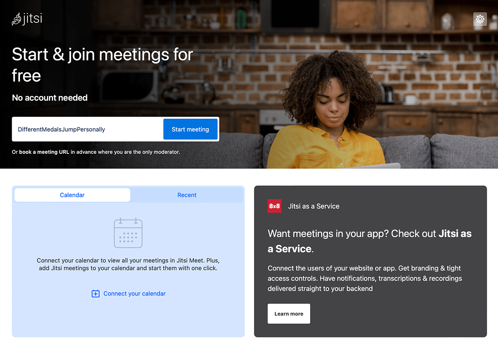
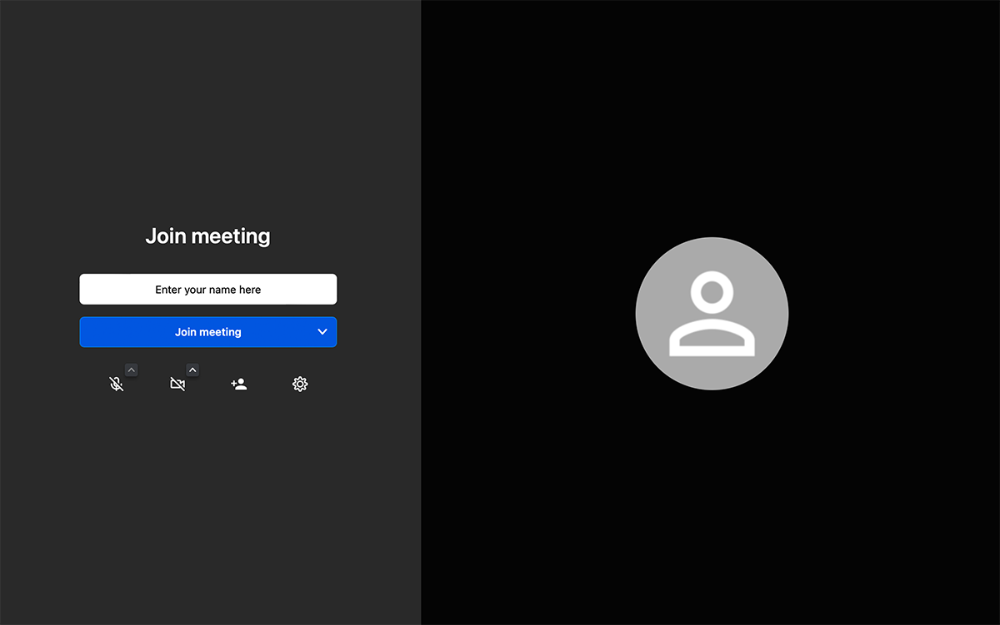

## 桌面或移动浏览器

1. 您需要一个浏览器（请注意我们的单独信息）。
2. 打开浏览器，在地址栏中输入，例如 "https://meet.jit.si"（不带引号），然后按 <kbd>Enter</kbd>。
3. 页面将打开，如下图所示：

4. 现在在“开始新会议”字段中输入您的会议名称（例如，新会议）。
   注意：请勿使用任何特殊字符、空格或变音符号，因为这可能会导致问题。
   注意：Jitsi 提供了一项功能，可以自动建议会议名称。您可以覆盖这些名称。
5. 点击蓝色的 `Go` 按钮。
6. 将打开以下窗口：

7. 可能最初不会出现您的图像。为此，浏览器会询问您是否允许访问相机。请通过点击 `allow` 或 `permit` 确认此请求。有时，您还需要先点击屏幕底部的相机按钮，以激活允许相机访问的对话框。第一次使用 Jitsi 时，对麦克风也要做同样的操作。
8. 现在在“输入您的名字”字段中输入您的显示名称。
9. 点击蓝色的 `Join meeting` 按钮。
10. 如果您连接到 https://meet.jit.si 并且是第一个参与者，系统将要求您进行身份验证或等待主持人。您可以使用 Google、Facebook 或 GitHub 账户进行身份验证。
11. 祝您在第一次会议中玩得愉快。

:::note
如果您没有看到自己的视频图像，请检查以下几点：
您设备上的相机是否：

- 存在（屏幕顶部的小镜头/显示器上的外部摄像头），
- 已激活（某些笔记本电脑可以主动开关摄像头），
- 已插入（仅对外部摄像头必要），
- 已安装（某些设备需要先安装相机）。

:::

:::note
如果您无法传输声音，请检查以下几点：
您设备上的麦克风是否：

- 可用（尤其是桌面设备，麦克风通常没有集成。在这里，您需要一个外部麦克风或耳机，连接到PC上的适当端口），
- 已激活（某些集成麦克风或耳机的笔记本电脑上有一个开关可以启用/禁用麦克风），
- 已插入（仅对外部麦克风必要），
- 已安装（某些旧电脑需要先安装麦克风）。

:::
